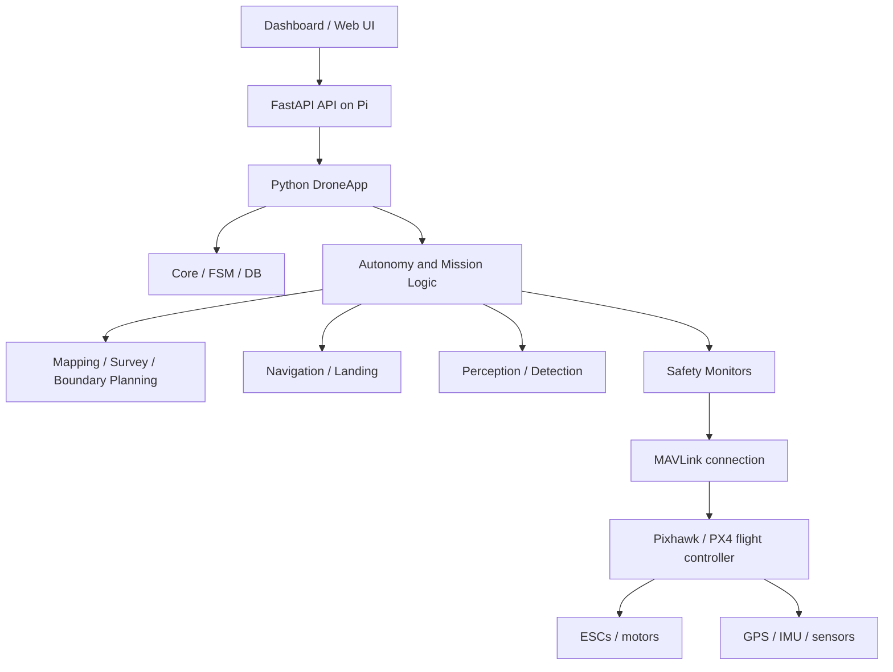

# Autonomous Smart Farming Drone

Autonomous Smart Farming Drone is a Python-based drone control project built around a Raspberry Pi companion computer and a Pixhawk/PX4 flight controller. The project is organized as a major-project research stack: the Pi handles orchestration, planning, telemetry, mission logic, and the dashboard; PX4 remains responsible for the actual flight stabilization, failsafes, and actuator control.

This repository is not a turnkey commercial flight product. It is a structured codebase intended for local development, hardware bring-up, SITL testing, and controlled agricultural field workflows.

## Table of contents

- [Project overview](#project-overview)
- [Architecture](#architecture)
- [Hardware assumptions](#hardware-assumptions)
- [Repository layout](#repository-layout)
- [Configuration model](#configuration-model)
- [Installation](#installation)
- [Raspberry Pi setup](#raspberry-pi-setup)
- [Pixhawk/PX4 setup](#pixhawkpx4-setup)
- [MAVLink configuration](#mavlink-configuration)
- [Running locally](#running-locally)
- [Running on a Pi](#running-on-a-pi)
- [Running with SITL](#running-with-sitl)
- [Dashboard](#dashboard)
- [Mission and survey features](#mission-and-survey-features)
- [Health, telemetry, and API](#health-telemetry-and-api)
- [Safety and degraded mode](#safety-and-degraded-mode)
- [Troubleshooting](#troubleshooting)
- [Documentation index](#documentation-index)
- [Tests and validation](#tests-and-validation)

## Project overview

The project is centered on a Raspberry Pi running a Python application that manages:

- MAVLink communication with a PX4/Pixhawk controller
- mission and survey planning
- telemetry logging and monitoring
- API and dashboard exposure
- health checks and safety gating

PX4 remains the authority for flight safety. The Pi can request actions, validate conditions, and manage mission logic, but it does not replace PX4 flight control.

The codebase is structured around these Python modules under `src/drone/`:

- `api/` — FastAPI service and websocket endpoints
- `autonomy/` — mission, flight manager, geofence, return-to-home logic
- `core/` — configuration, lifecycle, state machine, events
- `mavlink/` — MAVLink connection, commands, telemetry, and health checks
- `mapping/` — boundary mapping, coverage planning, KML conversion, surveying
- `navigation/` — landing, GPS, heading, position utilities
- `perception/` — camera, landing markers, obstacle detection, disease detection
- `safety/` — battery, CPU, GPS, link, watchdog, emergency handling
- `telemetry/` — recorder, metrics, publisher, logger

## Architecture



### Design principle

- PX4 handles stabilization, attitude control, and failsafe behavior.
- The Pi handles autonomy, planning, telemetry, health checks, and user-facing APIs.
- The dashboard provides monitoring and mission orchestration, but it does not replace flight-critical safety logic.

## Hardware assumptions

This repository expects the following physical arrangement:

- Raspberry Pi 4 or 5 as the companion computer
- Pixhawk/PX4-compatible flight controller
- GPS and telemetry connection to the Pixhawk
- USB camera or compatible camera on the Pi
- Optional obstacle sensors or computer vision inputs depending on configuration

The project is configured in YAML for hardware and environment settings. See:

- `config/default.yaml`
- `config/development.yaml`
- `config/production.yaml`
- `config/simulation.yaml`

## Repository layout

```text
.
├── .env.example
├── .github/
├── CHANGELOG.md
├── CONTRIBUTING.md
├── SECURITY.md
├── Dockerfile
├── Makefile
├── README.md
├── config/
│   ├── default.yaml
│   ├── development.yaml
│   ├── production.yaml
│   └── simulation.yaml
├── dashboard/
│   ├── README.md
│   ├── package.json
│   ├── src/
│   └── vite.config.ts
├── data/
│   ├── boundaries/
│   ├── detections/
│   ├── logs/
│   └── missions/
├── docs/
│   ├── architecture.md
│   ├── hardware.md
│   ├── installation.md
│   ├── raspberry-pi-setup.md
│   ├── pixhawk-setup.md
│   ├── mavlink.md
│   ├── flight-modes.md
│   ├── mission-planning.md
│   ├── farm-surveying.md
│   ├── boundary-mapping.md
│   ├── precision-landing.md
│   ├── obstacle-avoidance.md
│   ├── plant-disease-detection.md
│   ├── telemetry.md
│   ├── safety.md
│   ├── troubleshooting.md
│   └── deployment.md
├── firmware/
│   └── README.md
├── scripts/
│   ├── check_hardware.py
│   ├── check_mavlink.py
│   ├── health_check.sh
│   ├── install_pi.sh
│   ├── setup_environment.sh
│   ├── start_drone.sh
│   └── stop_drone.sh
├── simulation/
│   ├── README.md
│   ├── scenarios/
│   └── sitl/
├── src/
│   └── drone/
├── systemd/
│   ├── api.service
│   ├── drone.service
│   └── watchdog.service
├── tests/
│   ├── hardware/
│   ├── integration/
│   ├── simulation/
│   └── unit/
├── docker-compose.yml
├── pyproject.toml
├── LICENSE
└── ...
```

## Configuration model

The application loads a base config from `config/default.yaml` and overlays environment-specific config files. Environment variables override YAML values where applicable.

### Default configuration highlights

```yaml
# config/default.yaml
mavlink:
  connection: ${MAVLINK_CONNECTION:/dev/ttyACM0}
  baud: 115200
  heartbeat_timeout_s: 5.0
  reconnect_delay_s: 2.0

telemetry:
  rate_hz: 5
  log_dir: data/logs

mission:
  max_altitude_m: 30.0
  max_speed_mps: 8.0
  default_takeoff_alt_m: 15.0

safety:
  minimum_battery_percent: 25
  critical_battery_percent: 15
  gps_required: true
  min_satellites: 8
  max_hdop: 1.5

api:
  host: 0.0.0.0
  port: 8000
```

### Environment variables

The repo includes `.env.example` with the expected variables:

```dotenv
# .env.example
MAVLINK_CONNECTION=/dev/ttyACM0
MAVLINK_BAUD=115200
DRONE_CONFIG=config/production.yaml
API_HOST=0.0.0.0
API_PORT=8000
API_SECRET_KEY=change-me-generate-strong-secret
CORS_ORIGINS=http://localhost:5173
DB_PATH=data/drone.db
TELEMETRY_LOG_DIR=data/logs
ENVIRONMENT=production
```

Create a local `.env` from this file and keep it out of version control.

## Installation

The project is installed as a Python package from the root directory.

```bash
python3 -m venv .venv
source .venv/bin/activate
pip install -U pip
pip install -e ".[dev]"
```

This installs the package defined in `pyproject.toml`, which includes the `drone` entrypoint and the development dependencies (`pytest`, `pytest-asyncio`, `ruff`, `mypy`, `httpx`).

## Raspberry Pi setup

The repository includes a helper installer script for the Pi environment:

```bash
./scripts/install_pi.sh
```

That script does the following:

- checks Python version
- installs the project in editable mode
- copies `.env.example` to `.env` if absent
- runs a MAVLink connection check script
- prints the next steps

Example values for the Pi:

```bash
cp .env.example .env
nano .env
```

Set the relevant values for your hardware, especially:

```bash
MAVLINK_CONNECTION=/dev/ttyACM0
MAVLINK_BAUD=115200
DRONE_CONFIG=config/production.yaml
```

The project also ships with systemd service definitions under `systemd/`:

```bash
sudo cp systemd/*.service /etc/systemd/system/
sudo systemctl daemon-reload
sudo systemctl enable --now drone.service
```

`drone.service` and `api.service` assume a system-wide install under
`/opt/agridrone`. For a checkout with its own virtualenv, use
`systemd/agridrone.service` instead (edit the two paths to match the account):

```bash
sudo cp systemd/agridrone.service /etc/systemd/system/
sudo systemctl daemon-reload
sudo systemctl enable --now agridrone.service
```

It runs the venv interpreter, logs to `logs/drone_prod.log`, and restarts the
companion computer 5 s after any exit, so the API, camera stream and crop
monitor come back by themselves after a crash or reboot.

### Camera backends

`camera.type` selects how frames are captured:

| `type` | Path | Use for |
| --- | --- | --- |
| `auto` (default) | OpenCV V4L2, with a raw-Bayer (`GB10`) probe first | USB webcams and V4L2 sensors |
| `picamera2`, `csi`, `pi` | libcamera via picamera2 | Raspberry Pi CSI modules (OV5647, IMX219) |

Use `picamera2` for a Pi camera module. A CSI sensor exposes `/dev/video0` as a
raw Bayer/ISP node, and reading that node with OpenCV can stall or abort the
whole process; libcamera owns buffer negotiation, so the picamera2 backend is
the reliable one. If picamera2 is missing, the service reports
`CAMERA_UNAVAILABLE` and keeps running rather than crashing.

picamera2 is an apt package (`python3-picamera2`), not a PyPI dependency, so a
virtualenv cannot see it by default. `scripts/setup_environment.sh` writes a
`.pth` file exposing `/usr/lib/python3/dist-packages` to the venv, but only when
the venv and system interpreters share a major.minor version (otherwise the
extension modules would fail to load). Verify the camera is enumerated:

```bash
rpicam-hello --list-cameras   # must list the module
curl -s localhost:8000/api/camera/status
```

If no camera is listed after a reboot, power-cycle is not the fix — reseat the
CSI ribbon cable at both ends; the kernel log will show no `unicam` probe at
all when the sensor is not enumerated.

## Pixhawk/PX4 setup

This repository assumes PX4 is responsible for stabilized flight control and failsafe behavior. The Pi does not replace the flight controller.

Typical workflow:

1. Flash PX4 using QGroundControl.
2. Configure the airframe and calibrations.
3. Connect the Pixhawk serial/telemetry link to the Pi.
4. Verify serial device presence such as `/dev/ttyACM0`.
5. Ensure MAVLink heartbeat is present before starting autonomous behavior.

The project includes a MAVLink heartbeat check script:

```bash
python3 scripts/check_mavlink.py
```

This script checks whether the configured serial device or UDP/TCP target exists and whether the MAVLink connection can receive a heartbeat.

## MAVLink configuration

The repository explicitly supports the SITL UDP target used by PX4:

```text
udp://127.0.0.1:14540
```

The simulation config is:

```yaml
# config/simulation.yaml
mavlink:
  connection: udp://127.0.0.1:14540
  baud: 115200
```

The production config defaults to a local serial device, such as `/dev/ttyACM0`.

### Example runtime environment

```bash
export MAVLINK_CONNECTION=udp://127.0.0.1:14540
export MAVLINK_BAUD=115200
python -m drone.main --config config/simulation.yaml
```

## Running locally

The project can be run in a local development configuration.

```bash
python -m venv .venv
source .venv/bin/activate
pip install -e ".[dev]"
python -m drone.main --config config/development.yaml
```

This starts the Python app and loads the API using the development config.

## Running on a Pi

For the onboard Raspberry Pi runtime:

```bash
./scripts/install_pi.sh
cp .env.example .env
# edit .env to match hardware
python -m drone.main --config config/production.yaml
```

Or via the provided startup script:

```bash
./scripts/start_drone.sh
```

The default script uses `config/production.yaml` unless you pass a different config.

## Running with SITL

The repository includes a SITL startup helper:

```bash
./simulation/sitl/start_sitl.sh
```

This script prints the expected flow and starts the Python app with the simulation config:

```bash
python -m drone.main --config config/simulation.yaml
```

The repo’s simulation config sets:

- `mavlink.connection: udp://127.0.0.1:14540`
- `camera.enabled: false`
- `obstacle_avoidance.enabled: false`
- `precision_landing.enabled: true`
- `disease_detection.enabled: false`

This does not imply a fully validated real-world autonomous flight. It is intended for local simulation and software validation.

## Dashboard

The dashboard is a Vite + React app located in `dashboard/`.

### Install and run

```bash
cd dashboard
npm install
npm run dev
```

The package manifest (`dashboard/package.json`) defines:

```json
{
  "scripts": {
    "dev": "vite",
    "build": "vite build",
    "preview": "vite preview"
  },
  "dependencies": {
    "react": "^18.3.1",
    "react-dom": "^18.3.1"
  }
}
```

The UI is expected to consume the FastAPI backend over the local API and websocket endpoints. The websocket server in `src/drone/api/websocket.py` exposes:

- `/ws/telemetry`
- `/ws/events`
- `/ws/health`
- `/ws/mission`

## Mission and survey features

The application includes mission, boundary, survey, and autonomous planning logic in the `src/drone` modules:

- `autonomy/flight_manager.py`
- `autonomy/mission_manager.py`
- `autonomy/geofence.py`
- `autonomy/return_to_home.py`
- `mapping/survey_planner.py`
- `mapping/boundary_mapper.py`
- `mapping/coverage_planner.py`
- `mapping/waypoint_generator.py`

The repository also includes sample mission/boundary data:

- `data/missions/example.yaml`
- `data/boundaries/example.geojson`

The API supports:

```bash
GET /api/missions
POST /api/missions
GET /api/missions/{mid}
POST /api/missions/{mid}/start
POST /api/missions/{mid}/abort

POST /api/boundaries
POST /api/boundaries/import-kml
POST /api/survey/generate
```

These endpoints are implemented in `src/drone/api/server.py` and should be treated as real, repository-backed interfaces.

## Health, telemetry, and API

The FastAPI server exposes the following primary endpoints:

```bash
GET /api/health
GET /api/drone/status
GET /api/drone/telemetry
GET /api/drone/preflight
POST /api/drone/arm
POST /api/drone/takeoff
POST /api/drone/rtl
POST /api/drone/land
GET /api/detections
GET /api/logs
```

### Health check

```bash
curl -sf http://localhost:8000/api/health
```

### Status telemetry

```bash
curl http://localhost:8000/api/drone/status
curl http://localhost:8000/api/drone/telemetry
```

### Health script

```bash
./scripts/health_check.sh
```

This script performs a basic health check against the local API endpoint.

## Safety and degraded mode

Safety rules are mandatory in this project:

1. PX4 safety and failsafes are authoritative.
2. The Pi should never claim flight readiness without a real health check.
3. A UI status is not equivalent to flight readiness.
4. If a camera, sensor, or model is unavailable, the system must report a degraded or unavailable state rather than a ready state.

The repo explicitly implies this pattern through the configuration and health-checking approach. Some modules provide warnings for unavailable hardware and degraded functionality. The documentation should not claim `READY` unless a real check has passed.

The project uses status conditions such as:

- `CAMERA_UNAVAILABLE`
- `OBSTACLE_SENSOR_UNAVAILABLE`
- `MODEL_NOT_AVAILABLE`
- `DEGRADED`

These are safety concerns, not marketing states.

## Troubleshooting

### Common checks

```bash
python3 scripts/check_mavlink.py
curl -sf http://localhost:8000/api/health
ls -l /dev/ttyACM*
```

### Typical issues

- No MAVLink heartbeat: check the serial device path and baud rate.
- API not responding: confirm the Python server is running and listening on port 8000.
- Dashboard not updating: verify the backend is running and websocket endpoints are accessible.
- SITL not connecting: confirm the PX4 SITL instance is running on `udp://127.0.0.1:14540`.
- Mission logic not starting: verify the mission or boundary data is valid and the drone is not in a preflight-failed state.

## Documentation index

The repository includes focused documentation pages under `docs/`:

- `docs/architecture.md` — system architecture and role split
- `docs/hardware.md` — hardware expectations
- `docs/installation.md` — installation steps
- `docs/raspberry-pi-setup.md` — Pi setup
- `docs/pixhawk-setup.md` — PX4 and Pixhawk setup
- `docs/mavlink.md` — MAVLink configuration
- `docs/flight-modes.md` — high-level flight-state guidance
- `docs/mission-planning.md` — mission planning and execution guidance
- `docs/farm-surveying.md` — survey workflows
- `docs/boundary-mapping.md` — field mapping and boundary handling
- `docs/precision-landing.md` — landing-specific behavior
- `docs/obstacle-avoidance.md` — obstacle handling and safety constraints
- `docs/plant-disease-detection.md` — disease recognition workflow
- `docs/telemetry.md` — telemetry data and monitoring
- `docs/safety.md` — safety policies
- `docs/troubleshooting.md` — troubleshooting
- `docs/deployment.md` — deployment guidance

## Tests and validation

The project uses pytest and is organized into unit, integration, simulation, and hardware tests.

### Run the unit/integration checks

```bash
pytest tests/unit tests/integration -q
```

This matches the CI workflow in `.github/workflows/ci.yml`.

### Linting

```bash
ruff check src tests
```

### Local convenience commands

```bash
make install
make test
make lint
make run
make sim
```

## Final note

This is a developing drone automation project whose safety model is intentionally conservative. The repository is structured for experimentation, local validation, SITL testing, and real hardware bring-up, but no real flight should be claimed without actual hardware and safety verification.

The project should be treated as a Pi + PX4 companion-controller stack with real safety boundaries, not as a black-box autonomous drone system that is ready for unverified flight operations.

---

For more details, see the project docs in `docs/` and the code under `src/drone/`.
