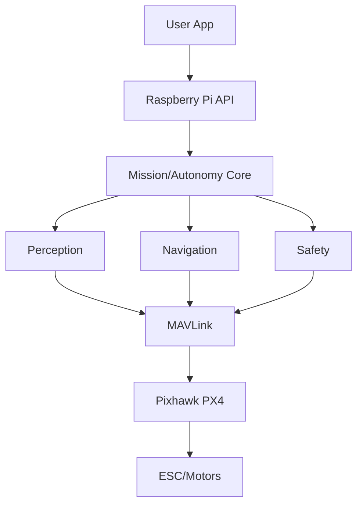

# Architecture

```mermaid
flowchart TD
  UI[User App] --> API[Raspberry Pi API]
  API --> CORE[Mission/Autonomy Core]
  CORE --> P[Perception]
  CORE --> N[Navigation]
  CORE --> S[Safety]
  P & N & S --> M[MAVLink]
  M --> PX[Pixhawk PX4]
  PX --> ESC[ESC/Motors]
```
PX4: stabilization/attitude/failsafes. Pi: autonomy/perception/planning. UI: monitoring only.
