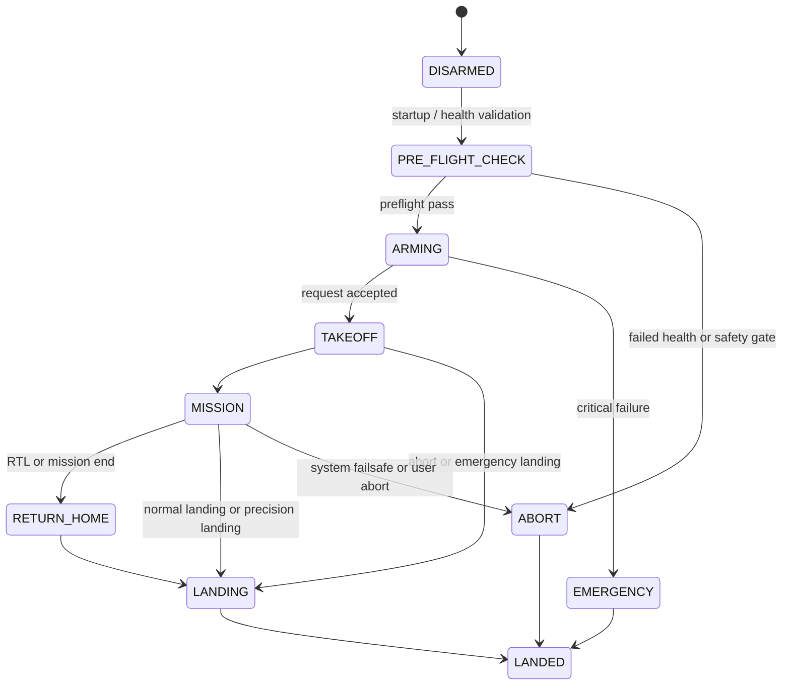

# Flight Modes and State Flow

This page records the project’s high-level operational states as implemented around the Python `DroneApp` and the state machine in `src/drone/core/state.py`.

## Purpose

The Pi app manages a high-level behavioral flow. This is not a substitute for PX4’s own flight controller state machine; it is a project orchestration layer around the hardware controller.

## State flow



## Operational interpretation

| State | Meaning |
| --- | --- |
| DISARMED | Controller is idle or unarmed |
| PRE_FLIGHT_CHECK | Health checks and system validation |
| ARMING | The operator requests arming after checks pass |
| TAKEOFF | The vehicle transitions into climb or launch |
| MISSION | Survey/mission flow is running |
| RETURN_HOME | Controlled return to home or safe mode |
| LANDING | Descent or precision landing flow |
| ABORT | Mission aborted for safety or invalid state |
| EMERGENCY | Critical failure mode |

## Actual repo behavior

The app exposes endpoints such as:

```bash
POST /api/drone/arm
POST /api/drone/takeoff
POST /api/drone/rtl
POST /api/drone/land
```

Those endpoints are defined in `src/drone/api/server.py` and exercise the app’s higher-level control flow.

## Safety rule

The project’s state machine must not override PX4 failsafes. If the controller reports an unsafe condition, the app should stop or route to safe recovery rather than continue autonomous behavior.

## Related docs

- [mavlink.md](mavlink.md)
- [safety.md](safety.md)
- [mission-planning.md](mission-planning.md)
