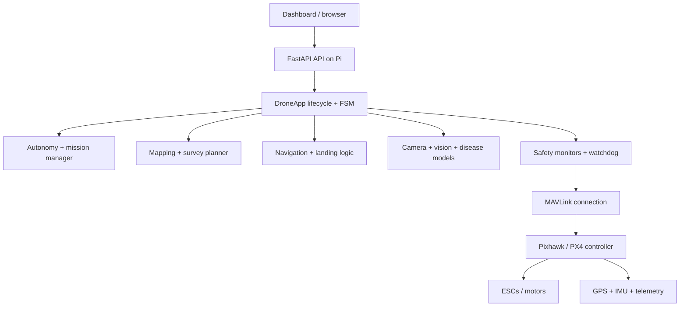

# Architecture

This project follows a simple responsibility split:

- Raspberry Pi runs the Python application and the dashboard-facing API.
- Pixhawk/PX4 provides stabilization, attitude control, and failsafe behavior.
- The UI is monitoring and control orchestration, not flight authority.

## Purpose

The architecture is designed for a companion-computer workflow: the Pi decides when to arm, take off, run surveys, and monitor health, while PX4 remains the final authority on actual flight control.

## System layout

## Responsibilities

| Layer | Responsibility | Authority |
| --- | --- | --- |
| Dashboard | Monitor telemetry and send commands | Secondary |
| Pi app | Mission orchestration, health, telemetry, DB, API | Operational |
| MAVLink layer | Connect to Pixhawk and fetch telemetry | Communication |
| PX4 | Stabilization, attitude control, failsafe logic | Authoritative |

## Actual project modules

The main Python components are in `src/drone/`:

- `api/`: FastAPI application and websocket endpoints
- `autonomy/`: mission, flight, geofence, return-to-home logic
- `core/`: config, lifecycle, state machine
- `mavlink/`: MAVLink commands, health, telemetry, parameters
- `mapping/`: boundaries, survey, coverage planning
- `navigation/`: GPS, heading, landing utilities
- `perception/`: camera, obstacle detection, plant disease logic
- `safety/`: battery, GPS, link, watchdog, emergency checks
- `telemetry/`: recorder, metrics, publisher

## Safety rule

`PX4 safety > Pi autonomy > UI state` is the project policy. The dashboard may report telemetry and mission status, but it is not allowed to override actual flight safety.

## Related docs

- [hardware.md](hardware.md)
- [mavlink.md](mavlink.md)
- [flight-modes.md](flight-modes.md)
- [safety.md](safety.md)
